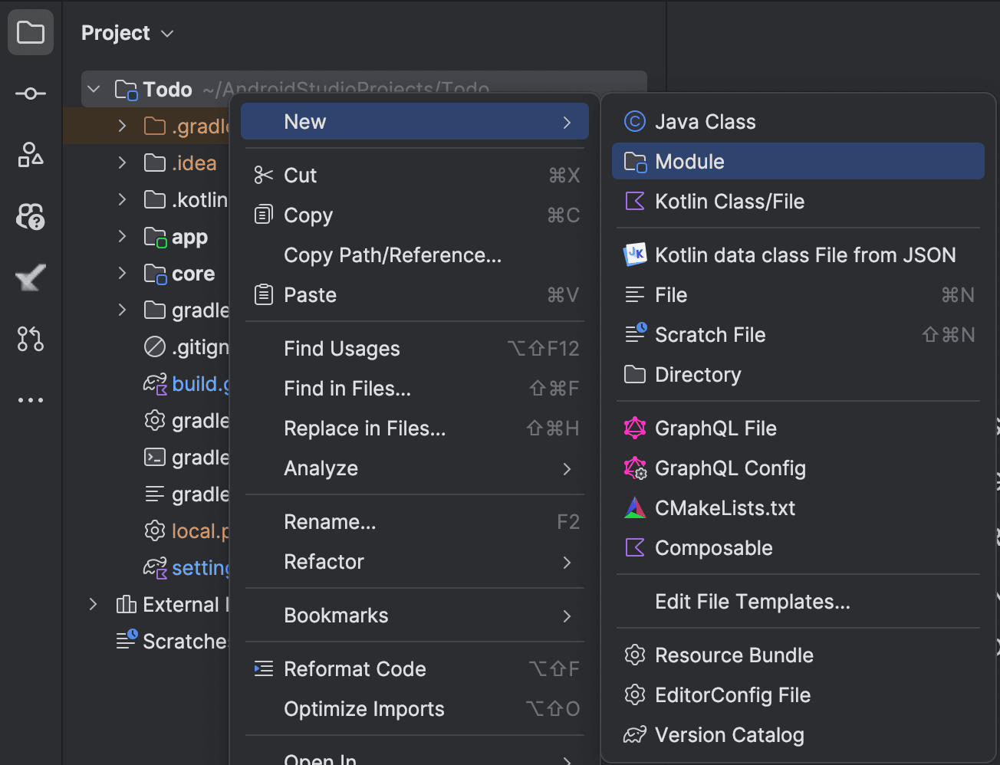
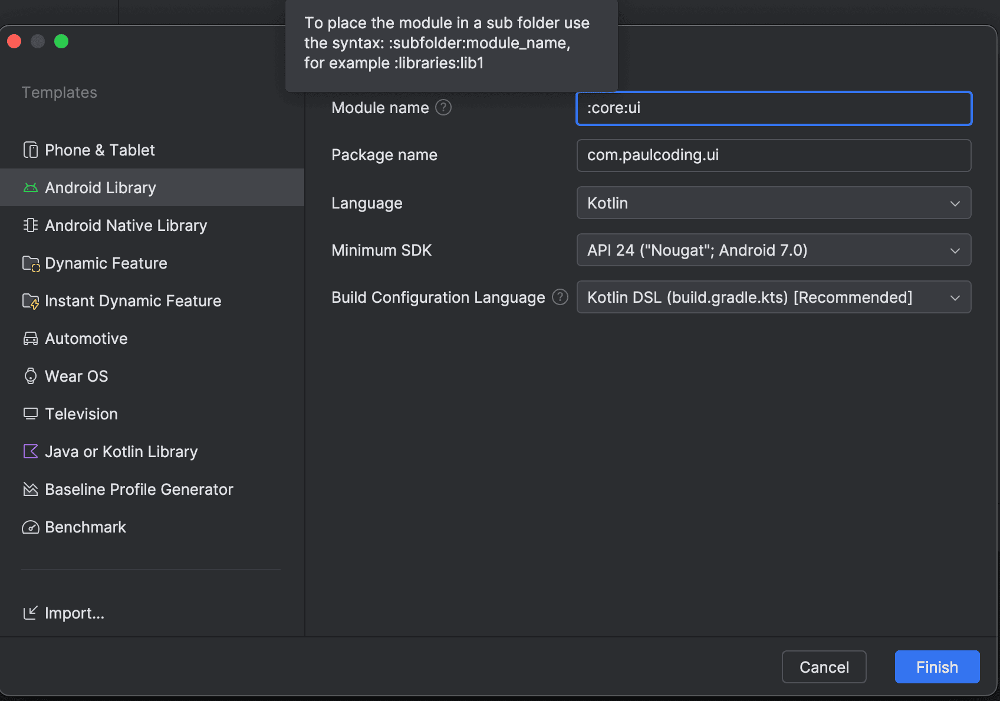

## Android Modularization

This post guides you through the process of modularizing an Android application. Modularization helps in organizing code, improving build times, and enhancing collaboration among developers.

[Learn more about modularization](https://developer.android.com/topic/modularization)

### Steps to Modularize an Android App

1. **Create a new module in Android Studio**  
   

2. **Organize modules under subfolders**  
   Name the module appropriately and place it under subfolders for better organization.  
   

3. **Remove unnecessary test folders (optional)**  
   Run the following commands to clean up unused files:

   ```sh
   cd :subfolder:module
   rm -rf consumer-rules.pro proguard-rules.pro src/androidTest src/test
   ```
