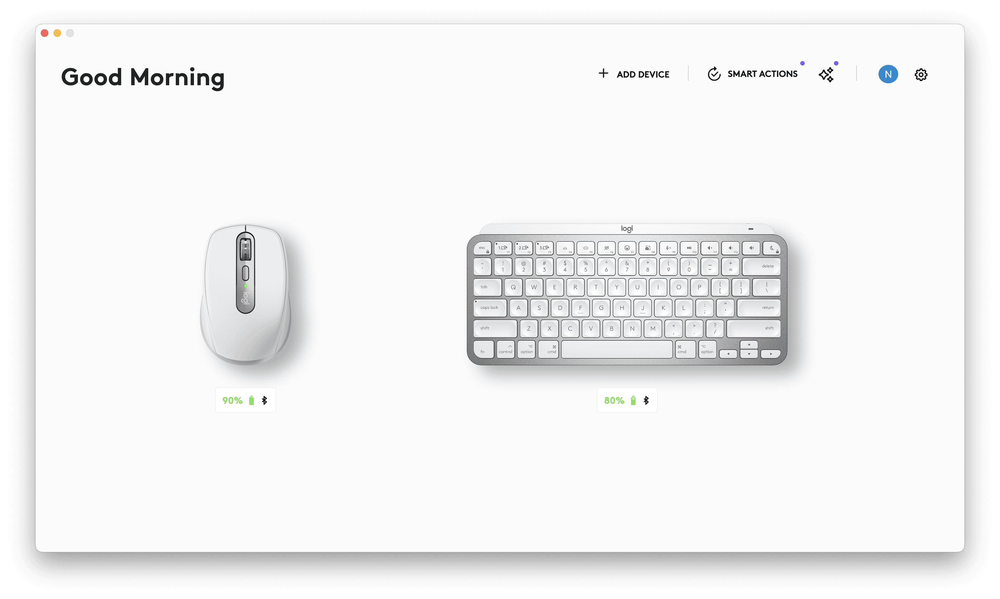
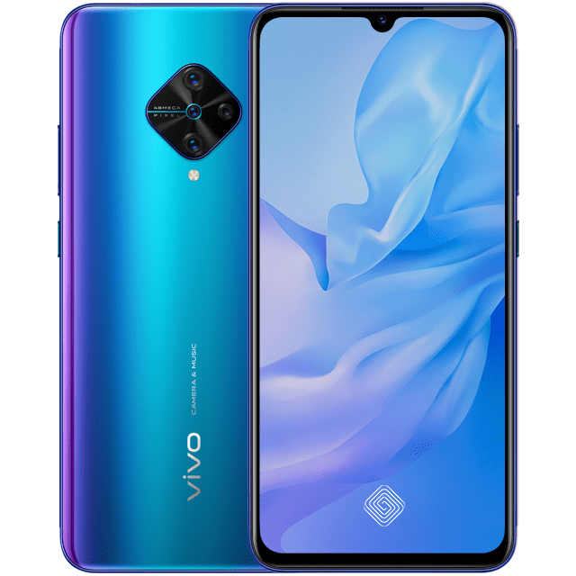
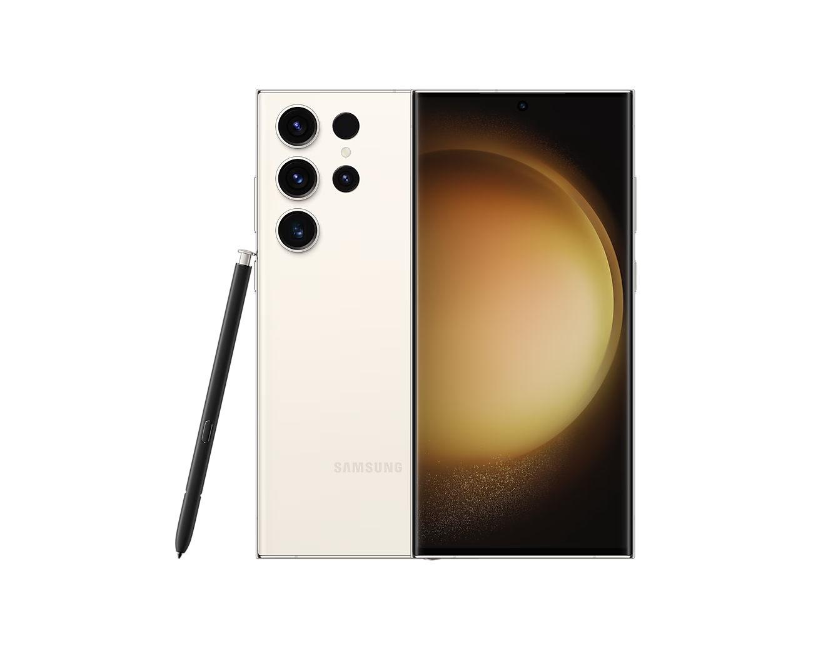
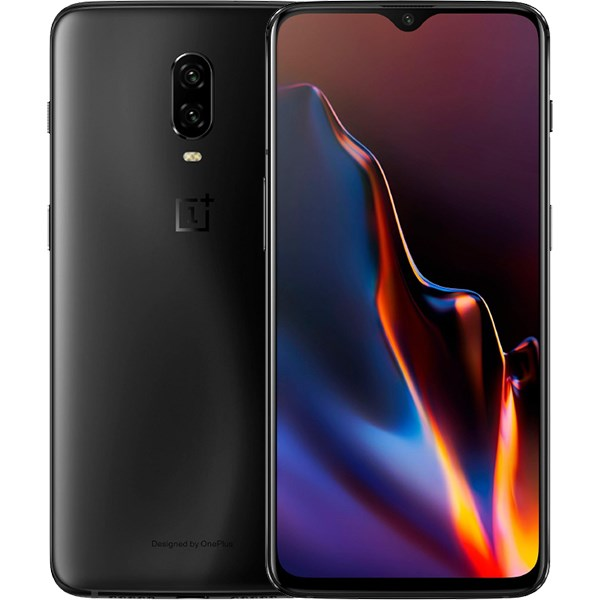
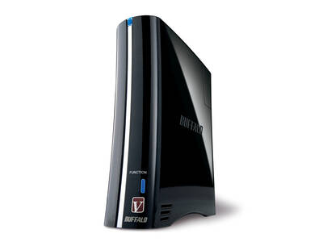
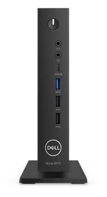
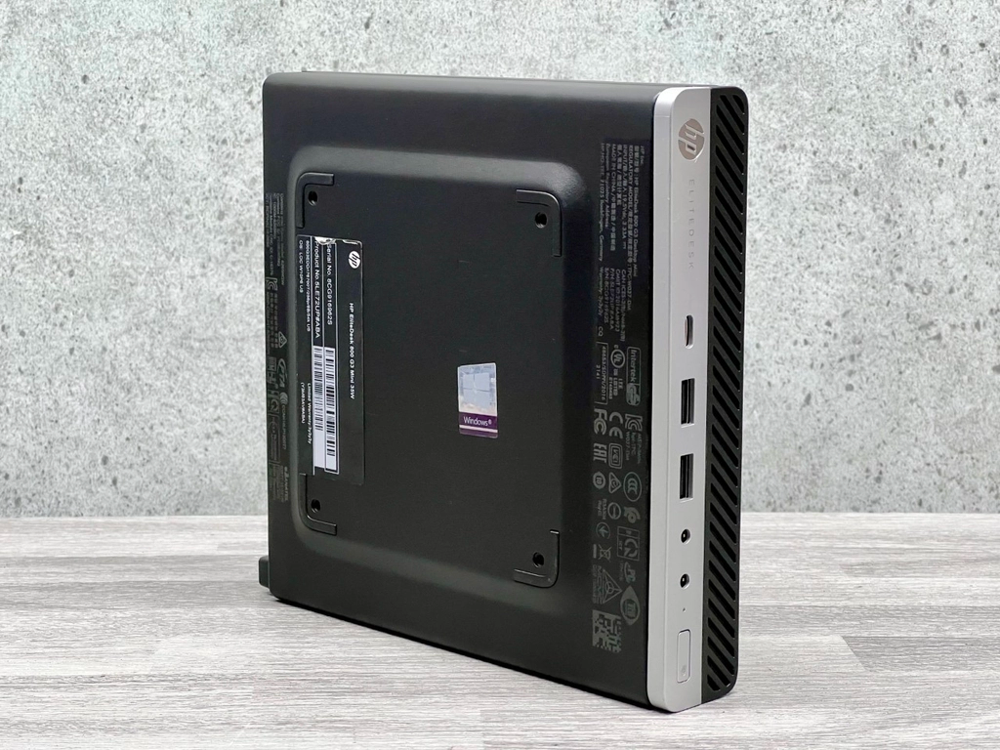
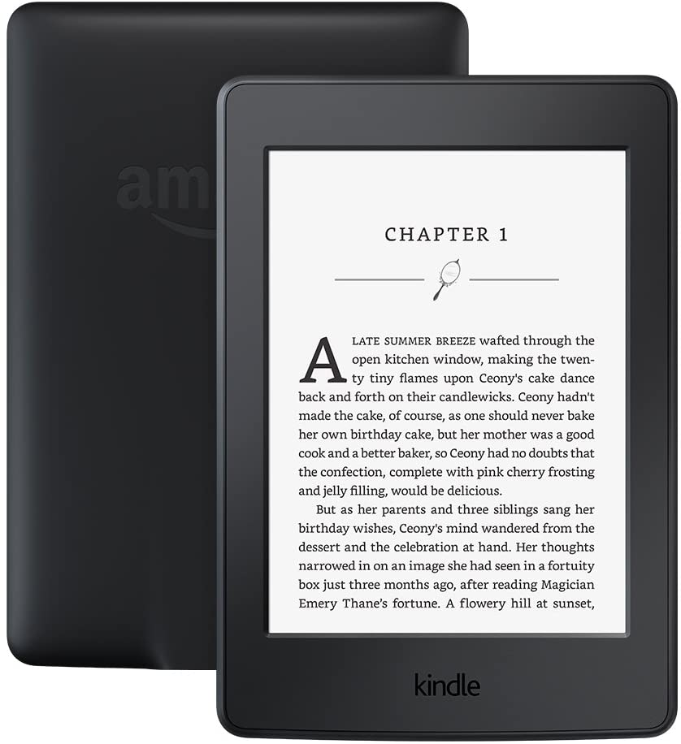
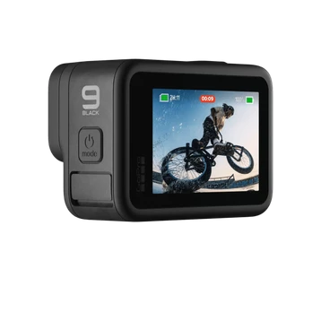
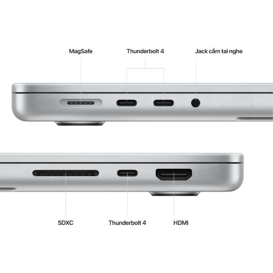

## Keyboard and Mouse

### MX Anywhere for Mac

Need [blowing](https://www.reddit.com/r/logitech/comments/z7prkx/comment/kz4vd2v/)

### MX Keys Mini for Mac

OK

## Phone

### Vivo s1 pro

Temppp phone. Generally Bad to 2024. About to be sold

### Samsung Galaxy S23 Ultra

Not much. Neutral. Only for Call and Bank.

### Oneplus 6T

Best. Lineage. Totally sastisfied

## Nas

### Buffalow LS-VL

Not much. Slow. Torrent. Huh

## TinyPC

### Wyse 5070

OK. Silent. Only NVME

### HP EliteDesk 800 G3 Mini 35W

OK. Additional HDD. Manuplation-Easy.  No-sleeping?.

## Kindle Paper 3

Dusty 'cause no-read

## 4G Router

### TP-Link TL-MR6400

OK. No port-fowarding

### Mobiphone D5000

Neutral

## Go Pro Hero 9

Nah.

## Macbook M2 Pro (32GB-512GB)

About to receive 🤤

