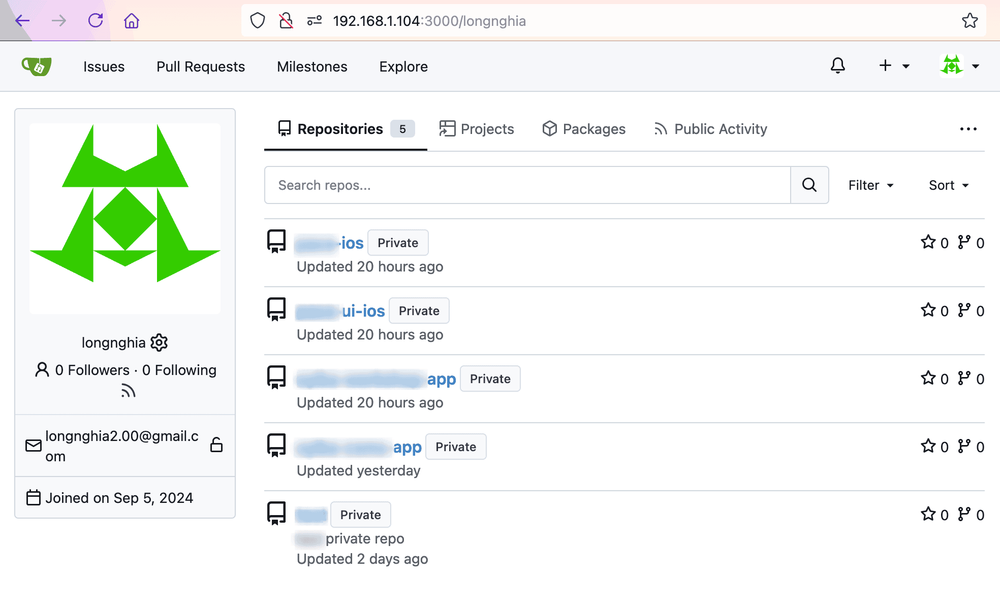

## Introduction

For backing up important repositories, I've chosen to use [Gitea](https://github.com/go-gitea/gitea), a self-hosted Git service. This post covers a simple deployment using Docker and how to work around SSH limitations.

## Deployment with Docker

The simplest approach is to deploy Gitea using Docker. However, this method makes it challenging to [passthrough the SSH port](https://docs.gitea.io/en-us/install-with-docker/#ssh-container-passthrough) between the container and the host.

I'm ok with that and use the HTTPS protocol instead.

## Adding Gitea as a Remote

To add Gitea as a second remote to your repository:

```sh
git remote add gitea http://192.168.1.104:3000/your-name/your-repo.git
git push gitea your-branch
```

To set Gitea as the main upstream remote:

```sh
git push --set-upstream gitea your-branch
# OR shorthand
git push -u gitea your-branch
```

## Result

After setting up your Gitea instance and pushing your repositories, you should see something like this:



## Conclusion

By self-hosting Gitea, you gain control over your code backups and version management.
