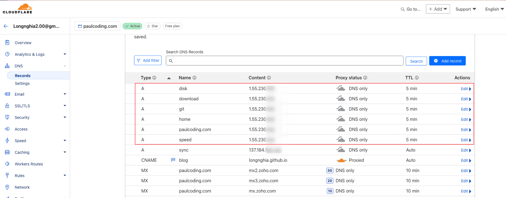
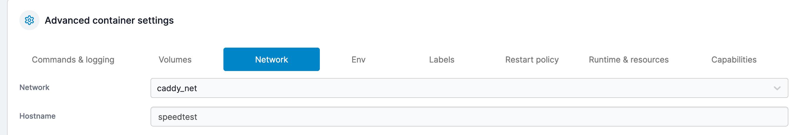
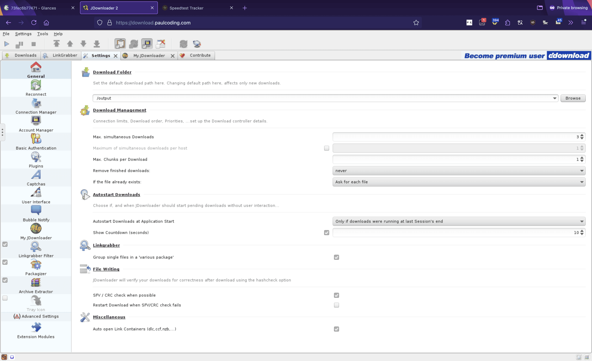
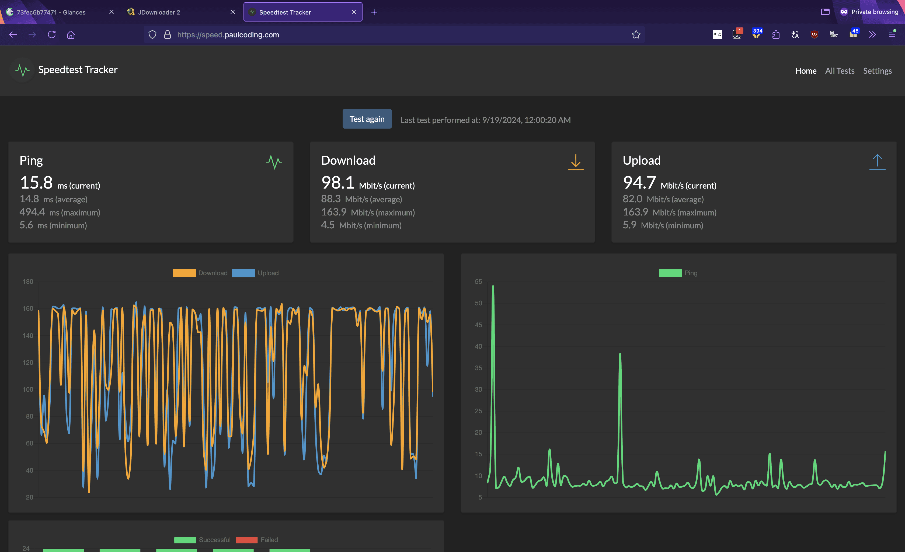

## Introduction

This guide will walk you through setting up a secure hosting environment for your services using Caddy as a reverse proxy. It'll cover:

1. Configuring Cloudflare DDNS
2. Setting up Caddy with Docker
3. Configuring services to work with Caddy

## 1. Configuring Cloudflare DDNS

First, we'll set up a Cloudflare DDNS (Dynamic DNS) container to keep your domain's IP address updated.

### Docker Compose Configuration

Create a `docker-compose.yml` file with the following content:

```yaml
version: '3.9'
services:
  cloudflare-ddns:
    image: timothyjmiller/cloudflare-ddns:latest
    container_name: cloudflare-ddns
    security_opt:
      - no-new-privileges:true
    network_mode: 'host'
    environment:
      - PUID=1000
      - PGID=1000
    volumes:
      - ./config.json:/config.json
    restart: unless-stopped
```

### Cloudflare Configuration

Create a `config.json` file with your Cloudflare settings:

```json
{
  "cloudflare": [
    {
      "authentication": {
        "api_token": "your-token",
        // OR use api_key instead
        "api_key": {
          "api_key": "your-api-key",
          "account_email": "your-email"
        }
      },
      "zone_id": "your-zone-id",
      "subdomains": [
        {
          "name": "speed",
          "proxied": false
        },
        {
          "name": "download",
          "proxied": false
        },
        {
          "name": "torrent",
          "proxied": false
        }
      ]
    }
  ],
  "a": true,
  "aaaa": true,
  "purgeUnknownRecords": false,
  "ttl": 300
}
```

Deploy the container:

```sh
docker compose up -d
```

Verify the subdomains in your Cloudflare dashboard:



## 2. Setting up Caddy with Docker

Now, let's set up Caddy as our reverse proxy.

### Docker Compose Configuration

Create a new `docker-compose.yml` file for Caddy:

```yaml
services:
  caddy:
    build: ./dockerfile-caddy
    container_name: caddy
    hostname: caddy
    restart: unless-stopped
    env_file: .env
    ports:
      - "80:80"
      - "443:443"
      - "443:443/udp"
    volumes:
      - ./Caddyfile:/etc/caddy/Caddyfile
      - ./caddy_config:/config
      - ./caddy_data:/data

networks:
  default:
    name: $DOCKER_MY_NETWORK
    external: true
```

### Dockerfile for Caddy

Create a `./dockerfile-caddy/Dockerfile` with:

```dockerfile
FROM caddy:2.8.4-builder AS builder

RUN xcaddy build \
    --with github.com/caddy-dns/cloudflare

FROM caddy:2.8.4

COPY --from=builder /usr/bin/caddy /usr/bin/caddy
```

### Environment Variables

Create a `.env` file:

```dotenv
TZ=Asia/Ho_Chi_Minh
DOCKER_MY_NETWORK=caddy_net
MY_DOMAIN=paulcoding.com
CLOUDFLARE_API_TOKEN=your-cf-token-here # this helps configuring ssl
```

### Caddy Configuration

Create a `Caddyfile`:

```caddyfile
(LAN_only) {
    @fuck_off_world {
        not remote_ip 192.168.1.0/24
    }
    respond @fuck_off_world "NOT FUCKING FOUND" 403
}

{
  acme_dns cloudflare {$CLOUDFLARE_API_TOKEN}
}

home.{$MY_DOMAIN} {
    reverse_proxy glances:61208
    import LAN_only
}

download.{$MY_DOMAIN} {
    reverse_proxy jdownloader:5800
    import LAN_only
}

speed.{$MY_DOMAIN} {
    reverse_proxy speedtest:8001
}
```



```caddyfile
handle_errors {
    rewrite * /{http.error.status_code}
    reverse_proxy https://http.cat
}
```



Deploy Caddy:

```sh
docker compose up -d
```

To reload Caddy's configuration:

```sh
docker exec -w /etc/caddy caddy caddy reload
```

Check logs for debugging:

```sh
docker logs caddy
```

## 3. Configuring Services

Ensure all your services are on the same Docker network as Caddy (`caddy_net`):



## Testing Your Setup

After configuration, you should be able to access your services via their respective subdomains:

| Subdomain   | Screenshot |
|-----------  |------------|
| [download.paulcoding.com](https://download.paulcoding.com)  |  |
| [home.paulcoding.com](https://home.paulcoding.com)  |  |
| [speed.paulcoding.com](https://speed.paulcoding.com)  |  |

If not on the LAN, you'll see an access denied message:



## Conclusion

You've now set up a secure hosting environment for your services using Caddy as a reverse proxy. This setup provides SSL encryption, easy service management, and LAN-only access for specific services.

## References

- [Caddy DNS Challenge Guide](https://github.com/DoTheEvo/selfhosted-apps-docker/tree/master/caddy_v2#Caddy-DNS-challenge)
- [Cloudflare DDNS](https://github.com/timothymiller/cloudflare-ddns)
