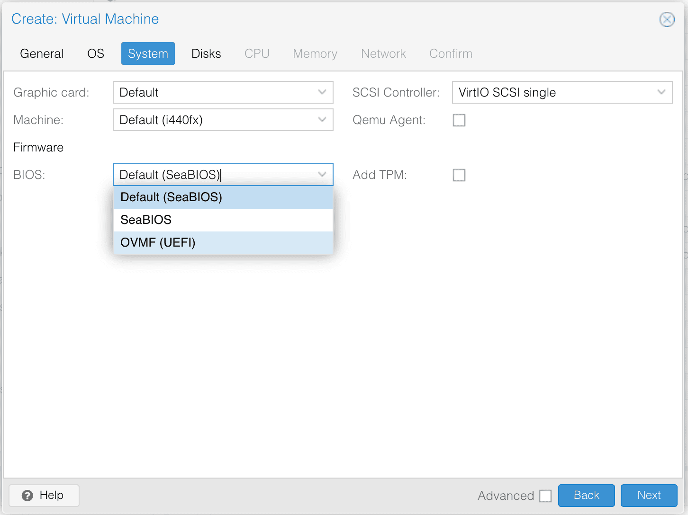

Yes, the time has finally come. I finally gave Arch Linux a shot. Took me a while and a few failed installs, but I got there in the end. Guess I couldn't avoid it forever 😅

## Why Arch Linux?

I was looking for a simple yet powerful setup for a NAS, and Arch Linux with Samba just made sense. It does exactly what I need, no extra fluff. Honestly, I got inspired by this very [comment](https://old.reddit.com/r/homelab/comments/1g3rx0z/nas_os_only_for_storage_no_bells_or_whistles/lrye5nz/) I came across, and it really clicked.

## Installing Arch Linux

### First Things First: SSH Over TTY

Let's face it, working in TTY is a PITA 🐧. Using your fancy iTerm via SSH sounds much better, right? Follow the [Arch Wiki guide](https://wiki.archlinux.org/title/Install_Arch_Linux_via_SSH) to set it up.

### Internet Connection

No ethernet at the moment? Let's connect to Wi-Fi instead via `nmcli` (NetworkManager CLI):

```sh
nmcli d
nmcli r wifi on
nmcli d wifi list
nmcli d wifi connect <SSID> password <password>
```

### Disk Partitioning

Here's my partition table (no swap partition for me):

| Device         | Size    | Type     | Mount Point |
| -------------- | ------- | -------- | ----------- |
| /dev/nvme0n1   | 500GB   | NVMe SSD |             |
| /dev/nvme0n1p1 | 512MB   | EFI      | /boot       |
| /dev/nvme0n1p2 | 499.5GB | ext4     | /           |
| /dev/sda       | 2TB     | ext4     | /media      |

Partitioning with `fdisk`:

```sh
fdisk /dev/nvme0n1
```

Follow these steps:

- `g` to create a GPT partition table.
- `n` to create partitions.
- `+512M` for the EFI partition.
- `t` to set partition types (1 for EFI, 83 for Linux).
- `p` to print the partition table.
- `w` to write changes.

### Disk Formatting


**Warning:** Ownership is configurable for Linux filesystems like ext4 and btrfs. However, for filesystems like exFAT, ownership is not configurable.


Format the partitions:

```sh
mkfs.ext4 /dev/nvme0n1p2
mkfs.vfat -F32 /dev/nvme0n1p1
mkfs.ext4 /dev/sda
```

### Mounting Disks

Mount the partitions:

```sh
mount /dev/nvme0n1p2 /mnt
mkdir /mnt/boot
mount /dev/nvme0n1p1 /mnt/boot
```

### Installing the Base System

Install essential packages:

```sh
pacstrap -K /mnt base base-devel linux linux-firmware git grub efibootmgr inotify-tools timeshift vim networkmanager pipewire pipewire-alsa pipewire-pulse pipewire-jack wireplumber reflector zsh zsh-completions zsh-autosuggestions openssh man sudo
```

### Generating `fstab`

```sh
genfstab -U /mnt >> /mnt/etc/fstab
```

### Chroot and Configuration

```sh
arch-chroot /mnt
ln -sf /usr/share/zoneinfo/Asia/Ho_Chi_Minh /etc/localtime
hwclock --systohc
nano /etc/locale.gen
locale-gen
echo "LANG=en_US.UTF-8" > /etc/locale.conf
echo "arch-nas" > /etc/hostname
```

Set root and user passwords:

```sh
passwd
useradd -mG wheel paul
passwd paul
EDITOR=vim visudo
```

Uncomment this line in `visudo`:

```sh
# Users in group wheel can run anything on any machine as any user
%wheel ALL=(ALL:ALL) ALL
```

### Installing GRUB

```sh
grub-install --target=x86_64-efi --efi-directory=/boot --bootloader-id=GRUB
grub-mkconfig -o /boot/grub/grub.cfg
```

### Final Steps

```sh
systemctl enable NetworkManager
exit
umount -R /mnt
reboot
```

## Post-Install

### Setting a Static IP

```sh
nmcli con mod "Wired connection 1" ipv4.addresses 192.168.1.100/24
nmcli con mod "Wired connection 1" ipv4.gateway 192.168.1.1
nmcli con mod "Wired connection 1" ipv4.dns "8.8.8.8 1.1.1.1"
nmcli con mod "Wired connection 1" ipv4.method manual
nmcli con up "Wired connection 1"
```

### Setting Up NAS with Samba

Install Samba:

```sh
pacman -S samba
cp /etc/samba/smb.conf.default /etc/samba/smb.conf
```

Edit `/etc/samba/smb.conf`:

```ini
[Storage]
   path = /mnt/storage
   writable = yes
   guest ok = no
   valid users = youruser
```

Add a Samba user:

```sh
useradd -m youruser
passwd youruser
smbpasswd -a youruser
```

### Mounting NAS on another Node

- Mount in `/etc/fstab`. Update the IP address and credentials accordingly:

```sh
//192.168.0.112/shared /media/nas cifs credentials=/etc/samba/credentials,iocharset=utf8,uid=1000,gid=1000,file_mode=0770,dir_mode=0770,nofail 0 0
```

- Create a credentials file:

```sh
echo "username=youruser" | sudo tee /etc/samba/credentials
echo "password=yourpassword" | sudo tee -a /etc/samba/credentials
```

## Troubleshooting

- **Lost Internet After Reboot?**

  ```sh
  sudo systemctl enable NetworkManager
  sudo systemctl start NetworkManager
  ```

- **SSH Key Mismatch?**

  > The SSH client's stored key for the server doesn't match the server's current key.

  ```sh
  ssh-keygen -R [server_address]
  ```

- **Proxmox UEFI Boot Mode**

  Remember to enable UEFI when creating a VM.



- **`mkfs` Failed Due to LVM**

  If you have a disk that is already used by LVM, you need to remove the LVM first before you can format the disk:

  ```sh
  pvs
  vgdisplay            # Note the VG name
  vgremove <vgname>    # Remove volume group
  pvremove /dev/sdb    # Remove the PV metadata
  ```

- **Need to Shutdown from Login Prompt in TTY**

  Use the shortcut `Ctrl + Alt + Del` to shut down from the login prompt in TTY. See more details [here](https://unix.stackexchange.com/questions/45089/shutdown-from-login-prompt-in-tty).

## Conclusion

Installing Arch Linux isn't as terrifying as it seems, especially with AI to guide you. While I'll stick to my Mac for work, Arch Linux is now my go-to for personal NAS adventures. Whaterver, I'm finally saying it:

I use Arch, BTW. 😉

## References

- [Arch Wiki](https://wiki.archlinux.org)
- [Helpful Gist](https://gist.github.com/mjkstra/96ce7a5689d753e7a6bdd92cdc169bae)
