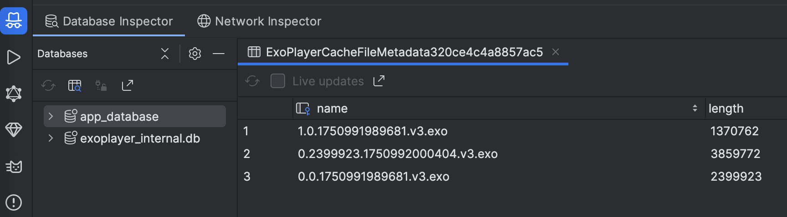

---
date: '2025-06-27T10:47:35+07:00'
draft: false
title: 'Inspect Room Database'
summary: 'How to inspect Room databases in Android apps'
categories:

- Code
tags:
- android
- room database
- sqlite

---

# Inspecting Room Databases in Android

Room is an ORM for SQLite on Android. Inspecting your Room database can help with debugging and development. Here are some common methods:

## 1. Using Android Studio Device Inspector

You can inspect databases directly from Android Studio:



1. Connect your device or emulator.
2. Open **View > Tool Windows > Device Explorer**.
3. Navigate to `data/data/{your.package.name}/databases/`.
4. Download the database file and open it with the built-in Database Inspector.

## 2. Using `sqlite3` and ADB

You can pull the database file from your device and inspect it with `sqlite3`.

### Find the Database Name

The database name is set in your `Room.databaseBuilder` call. For example:

```kotlin
Room.databaseBuilder(
    androidContext().applicationContext,
    AppDatabase::class.java, "app_database"
).fallbackToDestructiveMigration(false).build()
```

In this case, the database name is `app_database`.

### Get the Database Path

You can print the database path in your code:

```kotlin
println(getDatabasePath("app_database"))
```

### Pull the Database File

Replace `{your.package.name}` with your app's package name:

```sh
for file in $(adb shell 'ls /data/user/0/{your.package.name}/databases/app_database*'); do
  adb pull $file
done
```

### Inspect with sqlite3

```sh
sqlite3 app_database
```

Now you can run SQL queries directly on your Room database.

View sqlite3 commands [here](../sqlite3-cheatsheet/).
