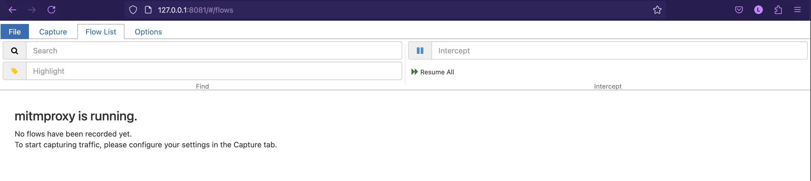

## Getting Started with mitmproxy

### Launch mitmweb

Start the mitmproxy web interface on port 8888:

```sh
mitmweb -p 8888 &
```



---

## Configuring iOS Devices

1. **Set Up Proxy:**  
     In your Wi-Fi settings, configure the HTTP proxy to your computer’s IP address and port `8888`.

2. **Install mitmproxy Certificate:**  
     - Open Safari and navigate to:  
       `http://mitm.it`
     - Select iOS and follow the instructions to download the mitmproxy certificate.
     - Install the certificate by going to:  
       `Settings > General > Profile`  
       Tap on the downloaded profile and install it.

3. **Enable Full Trust:**  
     Navigate to:  
     `Settings > General > About > Certificate Trust Settings`  
     Enable full trust for the mitmproxy root certificate.

---

## Configuring Android Devices

### Option 1: Manual Proxy

- Set the proxy in your Wi-Fi settings to point to your computer’s IP and port `8888`.
- **Install mitmproxy Certificate:**
  - Open a browser and go to:  
    `http://mitm.it`
  - Select Android and follow the instructions to download the mitmproxy certificate.
  - Install the certificate by going to:  
    `Settings > Security > Install from storage`  
    Choose the downloaded certificate file.

### Option 2: Using ADB

1. Connect your Android device via ADB.
2. Set the proxy:

     ```sh
     adb shell settings put global http_proxy <client-ip>:8888
     ```

3. **Remove Proxy (when finished):**

     ```sh
     adb shell settings put global http_proxy :0
     ```

> **Note:**  
> Remember to disable the proxy when you’re done. If not, your device may lose internet access when mitmproxy is not running.
