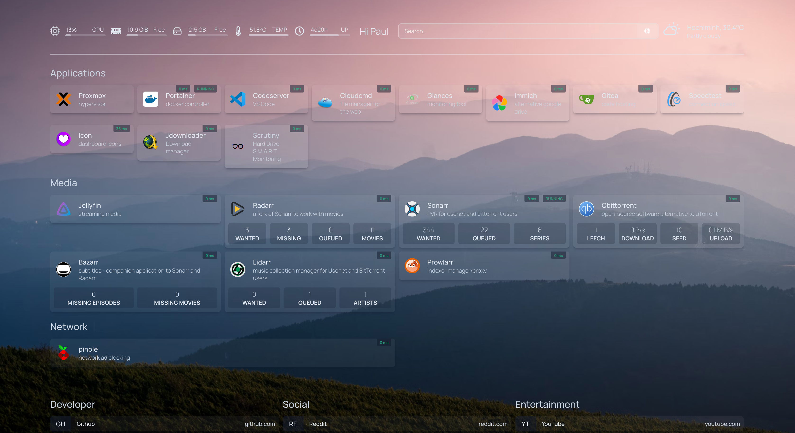

This page lists the various self-hosted services I run on my home server. Each service is containerized using Docker for easy management and isolation.

## Diagram

Here is a diagram of my self-hosted services architecture. It shows how different services are connected and interact with each other.



Here is the homepage for quick access to all my self-hosted services:

## Network

 [Pi-hole](https://pi-hole.net/)
: Network-wide ad blocking and DNS sinkhole. It blocks ads and trackers at the network level, improving browsing speed and privacy.

 [OpenVPN](https://openvpn.net/)
: Open-source VPN solution. Provides secure remote access to my home network from anywhere.

 [WireGuard](https://www.wireguard.com/)
: Fast, modern, and secure VPN tunnel. Offers an alternative to OpenVPN with improved performance and simplicity.

## Tools

 [HomePage](https://github.com/gethomepage/homepage)
: A modern, fully static, fast, secure fully proxied, highly customizable application dashboard. It provides a central hub for accessing all my self-hosted services.

 [Portainer](https://www.portainer.io/)
: Making Docker and Kubernetes management easy. It provides a web interface for managing Docker environments.

 [Code Server](https://github.com/coder/code-server)
: VS Code in the browser. Allows me to code from any device with a web browser.

 [JDownloader](https://jdownloader.org/)
: Download management tool. Automates and manages downloads from various sources.

 [Gitea](https://about.gitea.com/)
: A painless self-hosted Git service. Provides a GitHub-like interface for personal projects.

 [Cloud CMD](https://cloudcmd.io/)
: Web file manager with console and editor. Allows remote file management through a web interface.

 [qBittorrent](https://www.qbittorrent.org/)
: Free and reliable P2P BitTorrent client. Used for downloading and seeding torrents.

## Monitors

 [Glances](https://nicolargo.github.io/glances/)
: Cross-platform system monitoring tool. Provides a comprehensive view of system resources.

 [Speedtest](https://github.com/henrywhitaker3/Speedtest-Tracker)
: Continuously track your internet speed. Helps monitor ISP performance over time.

 [Scrutiny](https://github.com/AnalogJ/scrutiny)
: WebUI for smartd S.M.A.R.T monitoring. Helps predict and prevent disk failures.

## Media

 [Jellyfin](https://jellyfin.org/)
: The Free Software Media System. Streams my personal media collection to various devices.

 [Sonarr](https://sonarr.tv/)
: Smart PVR for newsgroup and bittorrent users. Automates TV show downloads and organization.

 [Radarr](https://radarr.video/)
: A fork of Sonarr to work with movies. Automates movie downloads and organization.

 [Bazarr](https://www.bazarr.media/)
: Companion application to Sonarr and Radarr for managing subtitles. Automatically downloads and manages subtitles for my media.

 [Prowlarr](https://github.com/Prowlarr/Prowlarr)
: Indexer manager/proxy for Sonarr, Radarr, Lidarr, etc. Centralizes and manages indexers for various \*arr applications.

 [Lidarr](https://lidarr.audio/)
: Music collection manager for Usenet and BitTorrent users. Automates music downloads and organization.
