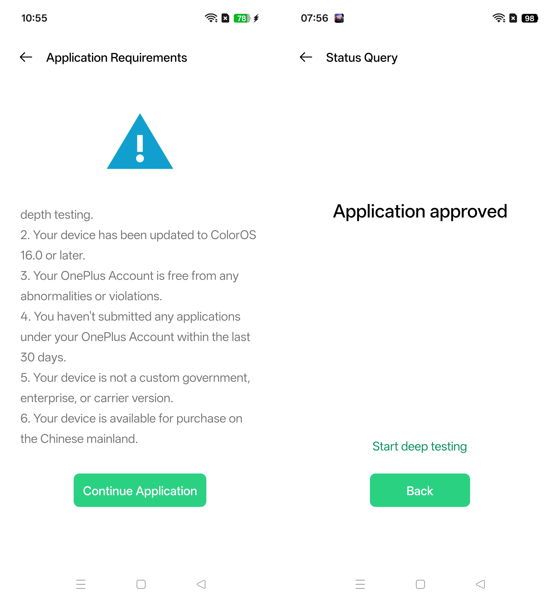
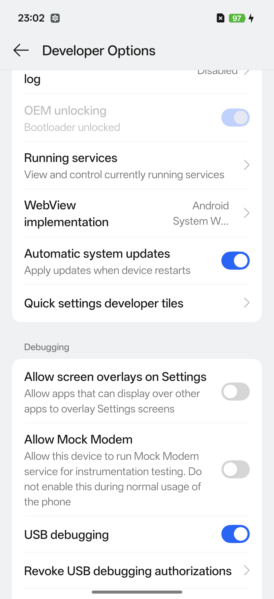

## Overview

Chinese OnePlus 15 models ship with ColorOS and regional locks. This guide covers unlocking the region/SIM and flashing the global OxygenOS ROM.

## Step 1: Regional SIM Unlock

### Official Method

Request a remote unlock through OnePlus support:

1. Use the **一加社区** (OnePlus Community) app
2. Request region unlock in **Remote diagnostics**
3. Receive unlock code and apply remotely

[Detailed guide by kpgc10kai](https://docs.google.com/document/d/1E-A4PAbOg1rulfwfiLTRQ2P90Tz4RG8WBueEqWwSe9Q/edit?tab=t.0)

### Verify Region Status

Check region code (should return 2):

```
*#*#3932433284#*#*
```

IMEI verification: https://support.oppo.com/cn/check/

## Step 2: Bootloader Unlock

### Enable Deep Testing

Download the deep test APK to enable OEM unlock:

- https://bbs.oneplus.com/thread/1926504022886318086
- https://bbsstatic.oneplus.com/public/apk/%E6%B7%B1%E5%BA%A6%E6%B5%8B%E8%AF%95.apk

Wait 1-2 days for deep testing approval.



### Unlock Bootloader

⚠️ **Warning**: Locking and Unlocking booloader will wipe all device data

```sh
adb reboot bootloader
fastboot flashing unlock
```



[Detailed XDA forum guide](https://xdaforums.com/t/plk110-coloros-to-oxygenos-glo-eu-in-na.4767949/)

## Step 3: Flash OxygenOS ROM

1. Download and unzip the global ROM
2. On macOS: ensure Android Platform Tools is installed and update fastboot path in `./Super_Flasher.sh` file
3. Reboot to bootloader and run flasher:

```sh
adb reboot bootloader
./Super_Flasher.sh
```

In Fastbootd: Select **English** → **Continue script** (skip format/reboot prompts on device)

When prompted: **Format data? → yes**

## Step 4: Lock Bootloader

Sync OTA updates twice before re-locking:


```sh
adb reboot bootloader
fastboot flashing lock
```

## Resources

- [XDA Forums Discussion](https://xdaforums.com/t/plk110-coloros-to-oxygenos-glo-eu-in-na.4767949/)
- [DroidWin Flashing Guide](https://droidwin.com/how-to-flash-fastboot-rom-on-oneplus-15/)
- [YouTube Tutorial](https://www.youtube.com/watch?v=mlIp5sO3OBM)
- Community feedback: Facebook groups [1](https://www.facebook.com/groups/393629286479968/posts/831568512686041/) [2](https://www.facebook.com/groups/2596417597113648/)
