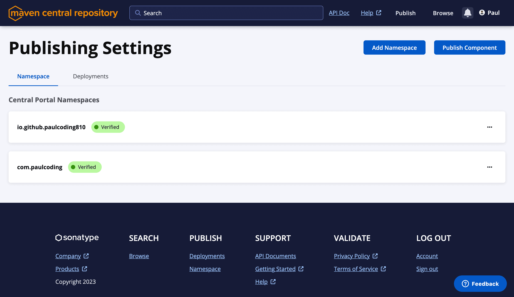

- Updated on 2025-02-22 [Added Github Actions section](#github-actions)

## Introduction

This guide explains how to publish an Android library to Maven Central using the Gradle Maven Publish Plugin.

## Setting Up Build Configuration

First, update your module's `build.gradle` file with the following configuration:

```gradle
import com.vanniktech.maven.publish.AndroidSingleVariantLibrary
import com.vanniktech.maven.publish.SonatypeHost

plugins {
    alias(libs.plugins.android.library)
    alias(libs.plugins.kotlin.android)
    id("com.vanniktech.maven.publish") version "0.30.0"
}

mavenPublishing {
    configure(
        AndroidSingleVariantLibrary(
            variant = "release",
            sourcesJar = true,
            publishJavadocJar = true,
        )
    )

    publishToMavenCentral(SonatypeHost.CENTRAL_PORTAL)
    signAllPublications()

    coordinates("com.example.mylibrary", "mylibrary-runtime", "1.0.3-SNAPSHOT")

    pom {
        name.set("My Library")
        description.set("A description of what my library does.")
        inceptionYear.set("2020")
        url.set("https://github.com/username/mylibrary/")
        licenses {
        license {
            name.set("The Apache License, Version 2.0")
            url.set("http://www.apache.org/licenses/LICENSE-2.0.txt")
            distribution.set("http://www.apache.org/licenses/LICENSE-2.0.txt")
        }
        }
        developers {
        developer {
            id.set("username")
            name.set("User Name")
            url.set("https://github.com/username/")
        }
        }
        scm {
        url.set("https://github.com/username/mylibrary/")
        connection.set("scm:git:git://github.com/username/mylibrary.git")
        developerConnection.set("scm:git:ssh://git@github.com/username/mylibrary.git")
        }
    }
}
```

## Testing with Local Maven

To test your configuration locally:

1. Run the following command:

```bash
./gradlew publishToMavenLocal
```

2. Verify the publication in your local Maven repository:

```bash
ls ~/.m2/repository/com.example.mylibrary/mylibrary-runtime
```

## Publishing to Maven Central

### Domain Verification

If you're using your own domain, you'll need to verify it by adding a TXT record to your domain's DNS and check for namespace status at [https://central.sonatype.com/publishing/namespaces](https://central.sonatype.com/publishing/namespaces)



### GPG Key Setup

1. Export your secret keys at `~/.gnupg/`

```bash
gpg --export-secret-keys -o secring.gpg
```

2. List your GPG keys:

```bash
gpg --list-keys --keyid-format short
```


Fill this as the `signing.keyId` in next step.

### Configure Gradle Properties

Add the following to `~/.gradle/gradle.properties`:

```properties
mavenCentralUsername=username
mavenCentralPassword=the_password

signing.keyId=12345678
signing.password=some_password
signing.secretKeyRingFile=~/.gnupg/secring.gpg
```

### Github Actions

Get the `signingInMemoryKey` by running the following command:

```sh
gpg --export-secret-keys --armor keyId secretKeyRingFile | grep -v '\-\-' | grep -v '^=.' | tr -d '\n'
```

Add secrets to github actions:

```yaml
- name: Publish to Maven Local
        run: ./gradlew publishToMavenLocal
        env:
          ORG_GRADLE_PROJECT_mavenCentralUsername: ${{ secrets.SONATYPE_NEXUS_USERNAME }}
          ORG_GRADLE_PROJECT_mavenCentralPassword: ${{ secrets.SONATYPE_NEXUS_PASSWORD }}
          ORG_GRADLE_PROJECT_signingInMemoryKey: ${{ secrets.SIGNING_PRIVATE_KEY }}
          ORG_GRADLE_PROJECT_signingInMemoryKeyPassword: ${{ secrets.SIGNING_PASSWORD }}
```

### Publishing

1. Run the publish command:

```bash
./gradlew publishAllPublicationsToMavenCentral
```

2. Monitor your deployment status at [https://central.sonatype.com/publishing/deployments](https://central.sonatype.com/publishing/deployments)

## Additional Configuration

If your library includes Jetpack Compose code, add this to your module's `build.gradle`:

```gradle
plugins {
    alias(libs.plugins.kotlin.compose) apply false
}
```

## References

- [Gradle Maven Publish Plugin Documentation](https://vanniktech.github.io/gradle-maven-publish-plugin/central/)
