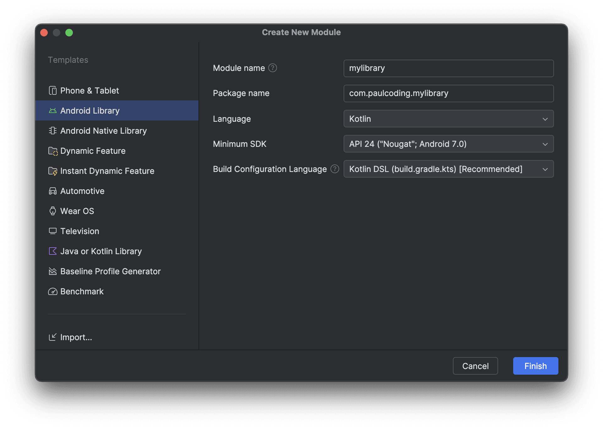

## Overview

This guide explains how to publish a Kotlin Android library to JitPack using Gradle Kotlin DSL build scripts.

## Step 1: Create Library Module

1. Create a new Android project (Empty Activity)
2. Add a new library module through Android Studio



## Step 2: Configure JitPack

Create `jitpack.yml` in your project root directory:

```yaml
jdk:
  - openjdk17
install:
  - ./gradlew :js:publishReleasePublicationToMavenLocal
```

> Note: Android Gradle plugin requires Java 17 to run

## Step 3: Update Library Build Script

Modify your library module's `build.gradle.kts`:

1. Add the `maven-publish` plugin to the plugins block:

```kotlin
plugins {
    alias(libs.plugins.android.library)
    alias(libs.plugins.kotlin.android)
    `maven-publish`
}
```

2. Add publishing configuration:

```kotlin
afterEvaluate {
    publishing {
        publications {
            create<MavenPublication>("release") {
                from(components["release"])

                groupId = "com.github.YourGithubUsername"
                artifactId = "your-library-name"
                version = "1.0.0" // Your library version

                pom {
                    name.set("Your Library Name")
                    description.set("Your library description")
                    url.set("https://github.com/YourGithubUsername/YourRepo")

                    licenses {
                        license {
                            name.set("The Apache License, Version 2.0")
                            url.set("http://www.apache.org/licenses/LICENSE-2.0.txt")
                        }
                    }

                    developers {
                        developer {
                            id.set("YourGithubUsername")
                            name.set("Your Name")
                            email.set("your.email@example.com")
                        }
                    }
                }
            }
        }
    }
}
```

## Step 4: Publishing to JitPack

### Check Your Release

1. Visit [JitPack](https://jitpack.io) and look up for your repository
2. If your latest commit isn't built automatically, you can trigger a build by accessing:

   ```
   https://jitpack.io/com/github/{username}/{repo}/{commit}/build.log
   ```

   Replace `{username}`, `{repo}`, and `{commit}` with your values.

## Step 5: Using Your Library

### Configure Repository

Add JitPack repository in your root `settings.gradle.kts`:

```kotlin
dependencyResolutionManagement {
    repositoriesMode.set(RepositoriesMode.FAIL_ON_PROJECT_REPOS)
    repositories {
        google()
        mavenCentral()
        maven { url = uri("https://jitpack.io") }
    }
}
```

### Add Dependency

In your app module's `build.gradle.kts`, add the dependency:

```kotlin
dependencies {
    implementation("com.github.username:repo:version")
}
```
