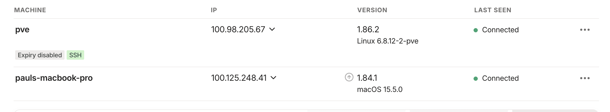

Managing a remote server can sometimes be tricky, especially when you lose SSH access due to a misconfiguration. If your server is located far away and you can't physically access it, this can be a real headache. In this post, I'll share a simple and effective solution to ensure you can always access your server, even if SSH stops working.

The solution? **Tailscale**—a secure, peer-to-peer VPN that makes your devices accessible from anywhere.

### Why Tailscale?

Tailscale creates a private network between your devices, allowing you to connect to your server securely without relying solely on SSH. Even if SSH is misconfigured or broken, Tailscale ensures you have a fallback method to access your server.

### Step-by-Step Guide

#### 1. Install Tailscale on Your Server

First, you'll need to install Tailscale on your server. Run the following commands:

```bash
curl -fsSL https://tailscale.com/install.sh | sh
sudo tailscale up
```

This will install Tailscale and bring it online. You'll be prompted to authenticate your server with your Tailscale account.

#### 2. Prevent Key Expiry for Trusted Servers

By default, Tailscale keys expire after a certain period for security reasons. If you want your server to remain accessible without frequent re-authentication, you can disable key expiry for trusted devices. Follow the instructions in the [Tailscale Key Expiry Guide](https://tailscale.com/kb/1028/key-expiry) to configure this.

Now you can access your server using its Tailscale IP address.



#### 3. Optional: Enable Tailscale Only on Reboot

If you prefer to keep Tailscale disabled by default and only enable it when the server restarts, you can disable the Tailscale service:

```bash
sudo systemctl disable tailscaled
```

This ensures Tailscale won't run continuously but will still be available when the server reboots.

---

With these steps, you'll have a reliable fallback method to access your server, even if SSH fails. Tailscale is lightweight, secure, and easy to set up, making it an excellent tool for remote server management.

Happy coding, and may your servers always be accessible!
