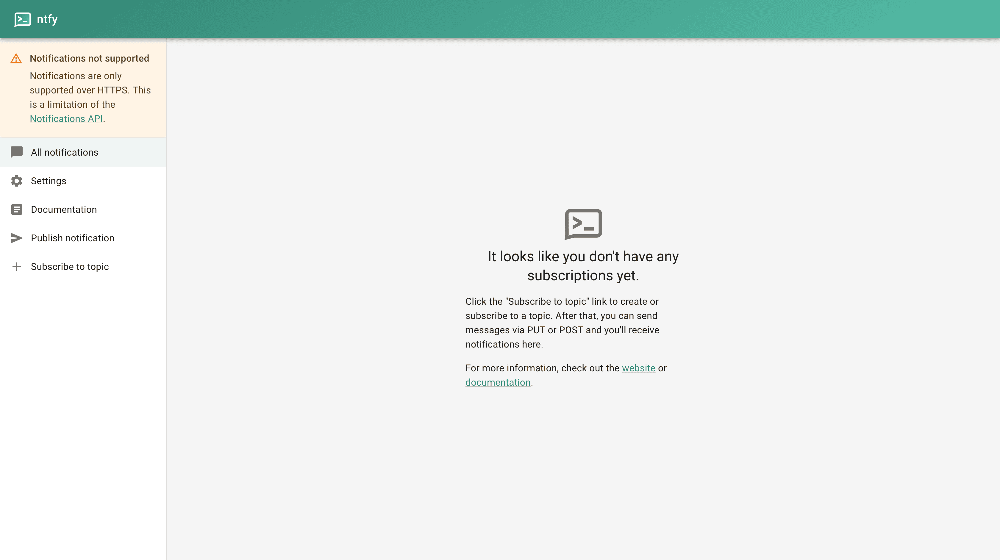
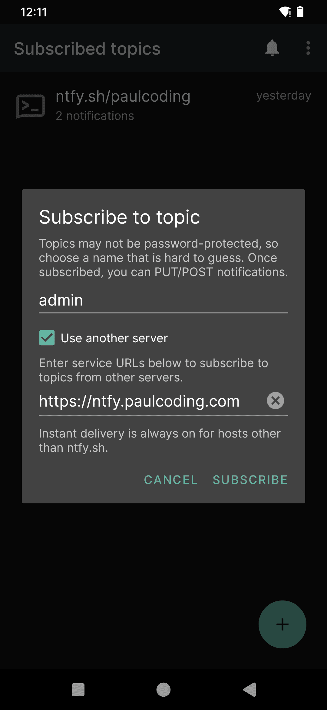
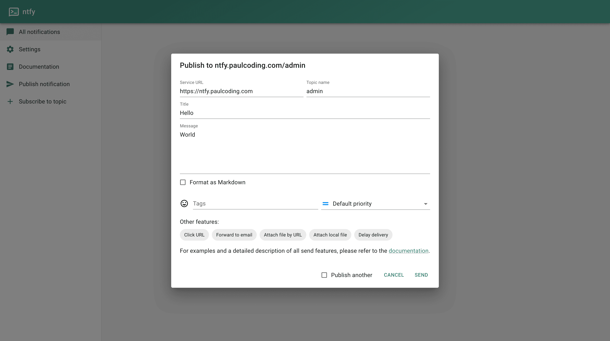
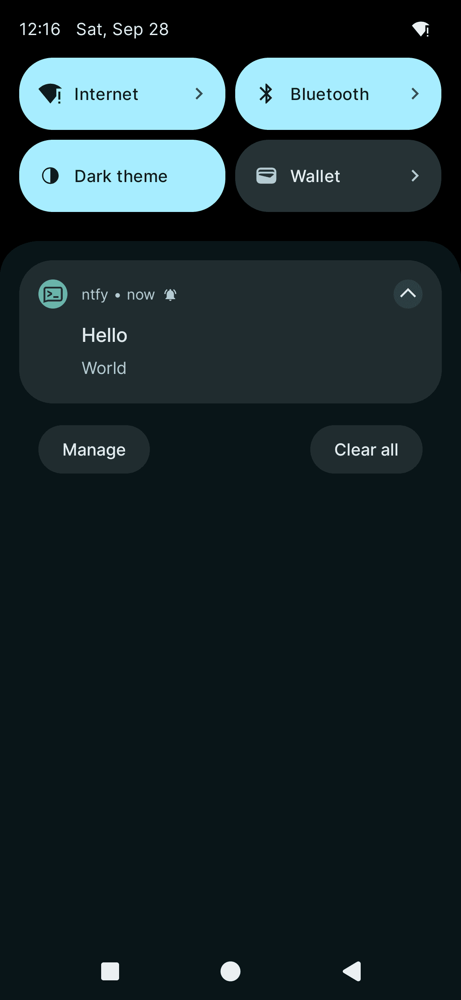
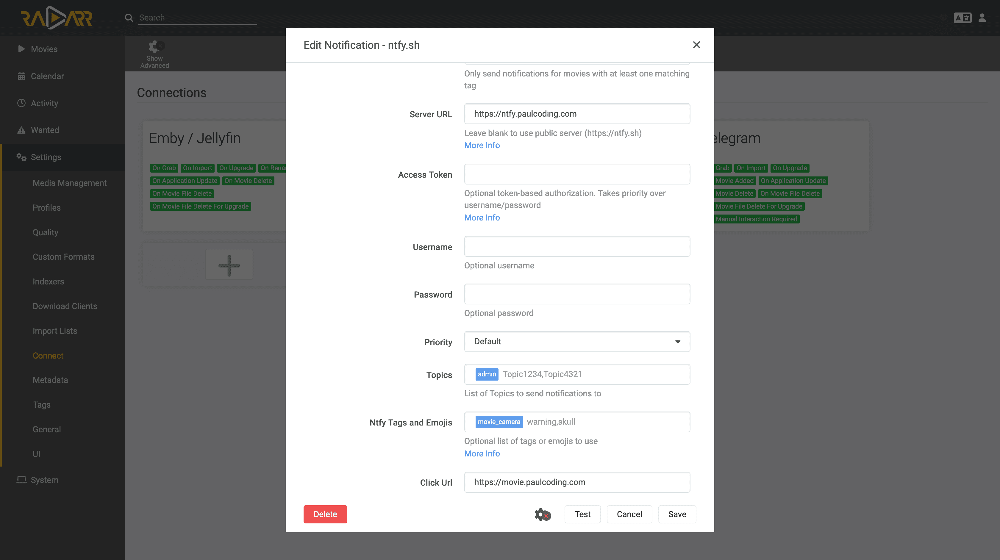
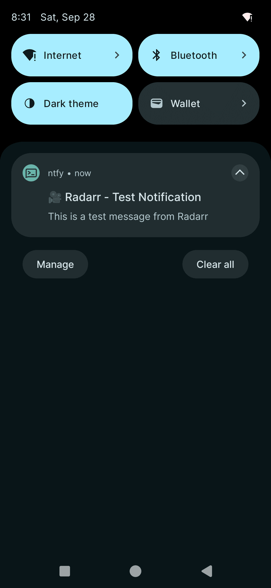

## Table of Contents

- [Table of Contents](#table-of-contents)
- [Introduction](#introduction)
- [Common Issue: ntfy Not Working on HTTP](#common-issue-ntfy-not-working-on-http)
- [Hosting ntfy with Caddy](#hosting-ntfy-with-caddy)
  - [Docker Compose Configuration](#docker-compose-configuration)
  - [Caddy Configuration](#caddy-configuration)
- [Mobile Setup](#mobile-setup)
- [Integration Example: Radarr](#integration-example-radarr)
- [Conclusion](#conclusion)

## Introduction

ntfy is a simple, lightweight notification service that allows you to send push notifications to your devices. This guide will walk you through self-hosting ntfy and integrating it with other services.

## Common Issue: ntfy Not Working on HTTP



ntfy requires HTTPS for security reasons. We'll address this by using [Caddy as a reverse proxy](/posts/host-your-saas-with-caddy/).

## Hosting ntfy with Caddy

### Docker Compose Configuration

```yaml
networks:
  caddy_net:
    external: true
    name: "caddy_net"

services:
  ntfy:
    image: "binwiederhier/ntfy:latest"
    container_name: "ntfy"
    command: ["serve"]
    environment:
      - "TZ=UTC"
      - "PATH=/usr/local/sbin:/usr/local/bin:/usr/sbin:/usr/bin:/sbin:/bin"
    networks:
      - "caddy_net"
    ports:
      - "8080:80/tcp"
    restart: "unless-stopped"
    user: "1000:1000"
    volumes:
      - "/etc/ntfy:/etc/ntfy"
      - "/var/cache/ntfy:/var/cache/ntfy"
```


### Caddy Configuration

Add this to your Caddyfile:

```caddyfile
ntfy.your-domain {
    reverse_proxy ntfy:80
}
```



**Note:** Set the port to 80, not 8080, as we're connecting to the `caddy_net`. Use 8080 for local testing only.



## Mobile Setup

1. Subscribe to a topic:
   

2. Test the notification by `curl`:

   ```sh
   curl -d "Hello World" ntfy.yourdomain.com/admin
   ```

3. Or Push notification via ntfy dashboard:
   

4. Mobile notification result:
   

## Integration Example: Radarr

1. Configure Radarr to use ntfy:
   

2. Radarr notification result:
   

## Conclusion

By self-hosting ntfy, you can have a secure, private notification system for various services. This setup using Docker and Caddy ensures HTTPS support and easy integration with other self-hosted applications.