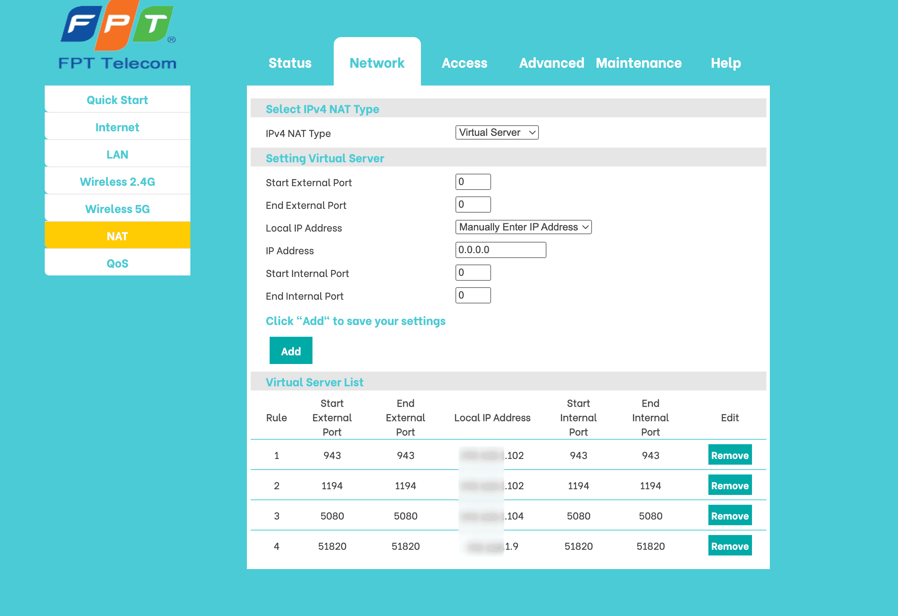

## Why Set Up Your Own VPN?

Imagine being able to access your home network securely from anywhere in the world. That's what a personal VPN (Virtual Private Network) can do for you! Here's why it's awesome:

1. **Extra Security**: It's safer than leaving multiple network ports open.
2. **Controlled Access**: Only you and those you trust can get in.
3. **Seamless Connection**: Use your home network as if you were there, no matter where you are!

## Choosing Your VPN Flavor

There are a few great options to pick from:

1. **OpenVPN**: The trusted classic. Super secure, but can be a bit complex to set up.
2. **WireGuard**: The new kid on the block. Fast, secure, and easier to configure.
3. **Tailscale**: For those who want things simple. Almost no setup required! (You need to configure tailscale client on every host.)

## Setting Up Your VPN: The Big Picture

1. Install the VPN server
2. Set up port forwarding on your router
3. Set up a way to find your home network (using DDNS)
4. Connect your devices to the VPN

## A Quick Heads-Up: Avoiding Network Conflicts


Before you dive in, make sure your VPN network doesn't clash with other networks you use regularly. This can save you a lot of headaches later!


As a noob, it takes me a lot of time to setup vpn network. I don't know why my phone connect easily, but my laptop connects without any internet 😭


Your phone on **cellular data** uses different address ranges than your home Wi-Fi. While your laptop usually connect to a Wi-Fi network that has the same subnet with the VPN server's, like `192.168.1.0`. Don't worry, there are ways to fix this!

[Learn more about this issue](https://superuser.com/questions/1623872/why-does-my-vpn-service-work-on-my-cellular-network-but-not-when-im-using-resid)



### How to Solve Network Conflicts

1. **Use Tailscale**: It automatically avoids these issues.
2. **For OpenVPN or WireGuard**:
   - Choose a unique network range for your VPN (recommended)
   - Or, change your home network's range (but this can be tricky)

## Step-by-Step Setup Guide

### 1. Installing Your VPN Server

We'll use Proxmox as an example:

- For OpenVPN: Check out the [Proxmox OpenVPN guide](https://pve.proxmox.com/wiki/OpenVPN_in_LXC)
- For WireGuard: The process is similar to OpenVPN
- For Tailscale: It's super easy! Just two commands to [get started](https://tailscale.com/kb/1031/install-linux)

### 2. Setting Up Port Forwarding

Tell your router to let VPN traffic through:
- OpenVPN: Usually uses ports 443 or 1194
- WireGuard: Typically uses port 51820



### 3. Making Your Home Network Findable (DDNS Setup)

If your home IP address changes, DDNS helps your VPN stay connected:
- No-IP: Free, but you need to log in regularly (I used to use it as it's supported by my router)
- DuckDNS: Also free, and doesn't require logins (check if your router supports it)
- Cloudflare DDNS: My current solution.

  If you have a domain on cloudflare (zone), you could leverage its useful [api](https://developers.cloudflare.com/dns/manage-dns-records/how-to/managing-dynamic-ip-addresses/) to keep your domain's ip updated. This can be achieved easily by cronjob, or a [Docker container](https://github.com/timothymiller/cloudflare-ddns) running at your host.

After this you could update your config file from step 1 to point to the domain name instead of IP.

### 4. Connecting Your Devices

1. Get the VPN configuration file from your server
2. Import it into a VPN client app on your device
3. Connect and enjoy secure access!

For OpenVPN, I recommend [Tunnelblick](https://tunnelblick.net/) on Mac.

## Making Sure It's Working

To check if WireGuard is running properly:

```sh
wg show
```

This will show you connected devices and some stats.

## Wrapping Up

Congratulations! You now have a personal VPN to securely access your home network from anywhere. This opens up a world of possibilities, like using your home Pi-hole ad-blocker on the go!

## Want to Learn More?

- [OpenVPN: Dive Deeper](https://openvpn.net/community-resources/)
- [WireGuard: Quick Start Guide](https://www.wireguard.com/quickstart/)
- [Tailscale: Easy Setup Instructions](https://tailscale.com/kb/1017/install/)
